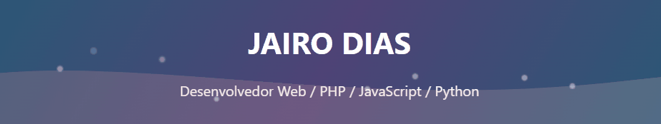

<h1 align="center">Olá👋🏻</h1>

---

**Me chamo Jairo, tenho 25 anos e sou natural de Bela Vista, no Maranhão. Gosto muito de programação e tecnologia, e estou sempre buscando aprender coisas novas, e pessoalmente tenho interesse em programação web. Já fiz curso técnico em Informática para internet pelo SENAC e atualmente curso Análise e Desenvolvimento de Sistemas na Universidade Estadual do Maranhão (UEMA). Estou em constante evolução e sempre procurando novas oportunidades para crescer na área de tecnologia.**

---

# Contatos

---

### 🤖 Linguagens e Tecnologias

 

 

          

 
 

<picture align="center">
  <source media="(prefers-color-scheme: dark)" srcset="https://raw.githubusercontent.com/jairoDias22/jairoDias22/output/github-contribution-grid-snake-dark.svg">
  <source media="(prefers-color-scheme: light)" srcset="https://raw.githubusercontent.com/jairoDias22/jairoDias22/output/github-contribution-grid-snake-dark.svg">
  
</picture>
